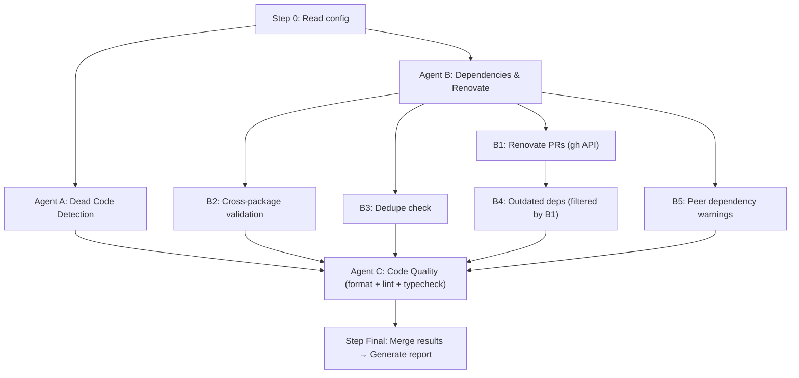

# Node/TypeScript Repository Maintenance

Perform a comprehensive health sweep for Node.js and TypeScript repositories.
Checks formatting, linting, type errors, dead code, dependency hygiene,
cross-package consistency, and open Renovate PRs. Reads `AGENTS.md` (or
`CLAUDE.md`) for repo-specific commands before running any checks.

## Arguments

- `--dry-run` (optional): Report issues without making changes.
- `--section <name>` (optional): Run only a specific section. Valid values:
  `formatting`, `dead-code`, `deps`, `renovate`. If omitted, run all sections.

**Target:** $ARGUMENTS (defaults to all sections, applying fixes)

---

## Execution Strategy

This skill is designed for **parallel execution** to minimize wall clock time.
After Step 0 (configuration discovery), launch Agents A and B in parallel for
the investigative workstreams. Once both complete, run Agent C (Code Quality)
last so formatting/linting/type-check fixes apply on top of any changes from
earlier steps. Only the dependency section has an additional internal ordering
constraint (Renovate PRs must complete before filtering outdated deps).



When launching parallel agents, pass them the discovered configuration from
Step 0 (package manager, available scripts, monorepo status) so they don't
need to re-read config files.

---

## Process

### 0. Read Repo-Specific Configuration

Before running any checks, read the repository's configuration files to discover
project-specific commands and conventions:

1. Read `AGENTS.md` (if it exists) for:
   - Lint / format / typecheck commands
   - Build commands
   - Test commands
   - Any repo-specific maintenance notes
2. Fall back to `CLAUDE.md` if `AGENTS.md` does not exist.
3. Read `package.json` (or the workspace root manifest) to identify:
   - Available scripts (`lint`, `format`, `typecheck`, etc.)
   - Package manager (`pnpm`, `npm`, `yarn`)
   - Whether this is a monorepo (look for `workspaces` field or
     `pnpm-workspace.yaml`)

Store discovered commands for use in subsequent steps. If a command is not
found, skip the corresponding check and note it in the report.

### Agent A: Dead Code Detection

**Goal:** Identify unused exports, imports, and files.

Launch this as a parallel Agent subagent.

> **Note:** This section is complementary to deterministic tools like
> [knip](https://knip.dev). If `knip` is configured in the repo, prefer running
> it. Otherwise, use heuristic detection.

1. **Check for knip:**

   ```bash
   # Look for knip in package.json scripts or devDependencies
   grep -q '"knip"' package.json && echo "knip available"
   ```

   If knip is available:

   ```bash
   pnpm knip            # or: npx knip
   ```

   If knip is not available, perform heuristic checks:

2. **Heuristic dead code scan** (when knip is unavailable):

   - Search for exported symbols that have no import references elsewhere:
     ```bash
     grep -rn "export \(const\|function\|class\|type\|interface\|enum\)" src/
     ```
   - For each export, check if it's imported anywhere else in the codebase.
   - Flag files with zero inbound imports (potential dead files).

3. **Report findings** as a list of potentially unused items. Do NOT
   auto-delete — dead code removal requires human review.

### Agent B: Dependencies & Renovate

**Goal:** Surface Renovate PRs, check dependency health, and report outdated
packages not already covered by Renovate.

Launch this as a parallel Agent subagent. Within this agent, run B1, B2, B3,
and B5 in parallel, then run B4 after B1 completes (B4 needs the Renovate
package list to filter outdated deps).

#### B1. Open Renovate PRs

1. List open PRs from Renovate:

   ```bash
   gh pr list --author "renovate[bot]" --state open --json number,title,url \
     --jq '.[] | "- #\(.number) \(.title) \(.url)"'
   ```

   If the above returns no results, also try:

   ```bash
   gh pr list --author "renovate" --state open --json number,title,url \
     --jq '.[] | "- #\(.number) \(.title) \(.url)"'
   ```

2. For each open Renovate PR, suggest running `/renovate-review`:

   ```
   Run `/renovate-review <PR-NUMBER>` to assess safety and effort.
   ```

3. **Collect the package names** covered by open Renovate PRs (parse the PR
   titles — Renovate titles typically follow `Update <package> to <version>`
   or `Update dependency <package> to <version>`). Store this set for use in
   B4.

4. If no open Renovate PRs are found, report that the repo is up to date with
   Renovate.

#### B2. Cross-Package Dependency Validation (Monorepos)

If this is a monorepo:

1. Check for version inconsistencies across packages:

   ```bash
   # For pnpm workspaces with catalogs
   cat pnpm-workspace.yaml

   # For npm/yarn workspaces, compare package.json files
   find . -name "package.json" -not -path "*/node_modules/*" \
     -exec grep -l '"dependencies"' {} \;
   ```

2. Flag any package that pins a different version of the same dependency than
   other packages in the workspace (unless the workspace uses a catalog or
   resolutions to centralize versions).

#### B3. Duplicate Dependencies in Lockfile

1. Check for duplicates:

   ```bash
   # pnpm
   pnpm dedupe --check   # or: pnpm dedupe (to fix)

   # npm
   npm dedupe --dry-run

   # yarn
   yarn dedupe --check
   ```

2. If `--dry-run` is not set and duplicates are found, run the dedup command
   and commit the result:

   ```bash
   pnpm dedupe
   git add pnpm-lock.yaml
   git commit -m "chore(deps): deduplicate lockfile"
   ```

#### B4. Outdated Dependencies (Not Covered by Renovate)

**Depends on B1** — wait for Renovate PR list before running.

1. Run the package manager's outdated check:

   ```bash
   pnpm outdated         # or: npm outdated / yarn outdated
   ```

2. **Filter out** any packages that already have an open Renovate PR (from the
   set collected in B1). Only report dependencies that are outdated AND not
   already being handled by Renovate.

3. Categorize the remaining results:

   - **Patch updates** — safe to update
   - **Minor updates** — likely safe, review changelogs
   - **Major updates** — requires migration planning

4. Report a summary table of outdated dependencies by category.

#### B5. Peer Dependency Warnings

1. Check for peer dependency mismatches:

   ```bash
   pnpm install --dry-run 2>&1 | grep -i "peer"
   # or: pnpm ls --depth 0 2>&1 | grep -i "WARN"
   ```

   Alternatively, parse warnings from the most recent `pnpm install` output or
   lockfile metadata.

2. **Report** mismatches grouped by severity:

   - **Version range conflicts** — installed version outside the expected peer
     range (e.g., plugin expects `cypress@4-13` but `15.x` is installed)
   - **Stale peer pins** — addon expects a newer version of its host package
     than what's installed (e.g., storybook addon expects `^10.2.14` but
     `10.2.10` is installed)

3. These are advisory — do not auto-fix peer dependency issues.

### Agent C: Code Quality — Formatting, Linting, and Type Checking

**Goal:** Ensure code style is consistent and free of lint/type errors.

Launch this Agent subagent **after Agents A and B complete** so that fixes
apply on top of any code changes from earlier steps. Within this agent, run
formatting, linting, and type checking as **parallel Bash commands** (they
don't depend on each other).

#### C1. Formatting

1. **Run the formatter** using the repo's configured command:

   ```bash
   # Use the command from AGENTS.md / package.json, e.g.:
   pnpm format          # or: pnpm prettier --write .
   ```

   If `--dry-run` is set, run the check variant instead:

   ```bash
   pnpm format --check  # or: pnpm prettier --check .
   ```

2. **Separate real issues from expected noise.** Formatter errors in CI config
   files (e.g., `.circleci-orbs/`, `codegen.*.yml`) that use template variable
   syntax (`${...}`) are often false positives — note them separately from
   actual source code formatting issues.

3. **Report** the number of files changed (or issues found in dry-run mode).

#### C2. Linting

1. **Run the linter** with auto-fix:

   ```bash
   pnpm lint --fix      # or: pnpm eslint --fix .
   ```

   If `--dry-run` is set, run without `--fix`:

   ```bash
   pnpm lint            # report only
   ```

2. **Report** the number of issues fixed and any remaining issues that require
   manual intervention.

#### C3. Type Checking

1. **Run the TypeScript compiler** in check mode:

   ```bash
   pnpm typecheck       # or: pnpm tsc --noEmit
   ```

2. If errors are found:

   - **Attempt to fix** straightforward issues (missing imports, unused
     variables, simple type mismatches).
   - **Flag for human review** any complex type errors that cannot be
     confidently auto-fixed.

3. **Report** the number of type errors found, fixed, and remaining.

#### C4. Commit

If any changes were made (and `--dry-run` is not set), stage and commit:

```bash
git add -A
git commit -m "chore: fix formatting, lint, and type errors"
```

### Final: Generate Report

After all agents complete, merge their results into a summary report:

```markdown
## Repository Maintenance Report

### Code Quality

- Formatting: X files fixed (or: "No issues found")
- Lint: X issues fixed, Y remaining
- TypeScript: X errors fixed, Y remaining (flagged for review)

### Dead Code

- Potentially unused exports: X
- Potentially dead files: X
- (See details above)

### Renovate PRs

- Open PRs: X
  - #123 Update foo to v2.0.0
  - #124 Update bar to v1.5.0
- Suggested action: Run `/renovate-review` on each

### Dependencies (not covered by Renovate)

- Outdated (patch): X
- Outdated (minor): X
- Outdated (major): X
- Peer dependency mismatches: X
- Duplicates in lockfile: X (resolved / not resolved)
- Cross-package inconsistencies: X

### Actions Taken

- [ ] Code quality fixes committed
- [ ] Lockfile deduplication committed
- [ ] (other actions)
```

---

## Guidelines

- **Always read AGENTS.md first.** Repo-specific commands take priority over
  generic fallbacks.
- **Maximize parallelism.** Launch Agents A and B simultaneously, then run
  Agent C after both complete. Within each agent, run independent commands in
  parallel where possible.
- **Never auto-delete code.** Dead code detection is advisory — flag items for
  human review.
- **Commit incrementally.** One commit per section keeps changes easy to review
  and revert.
- **Respect `--dry-run`.** When set, make zero changes — only report.
- **Handle missing tools gracefully.** If a tool (knip, prettier, eslint) is not
  installed, skip that check and note it in the report rather than failing.
- **Monorepo awareness.** Detect whether the repo is a monorepo and adapt
  dependency checks accordingly.
- **Renovate-first for outdated deps.** Always check Renovate PRs before
  reporting outdated dependencies to avoid duplicate work.
