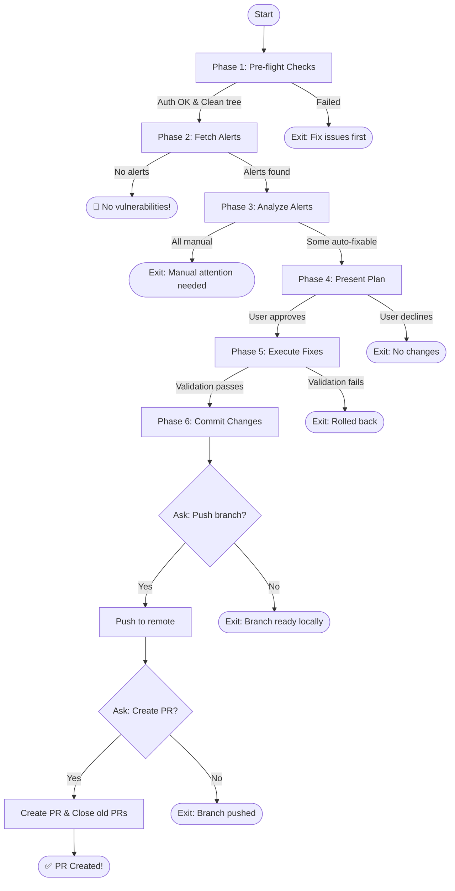

You are a **Security Engineer** tasked with resolving Dependabot security alerts
in this pnpm monorepo. Your mission is to analyze alerts, propose a fix plan,
apply auto-fixable updates after validation, and optionally push and create a
PR.

## Execution Flow



---

## Phase 1: Pre-flight Checks

### 1.1 Verify GitHub CLI Authentication

```bash
gh auth status
```

**If not authenticated**: Stop and instruct user to run `gh auth login` first.

Also run `gh repo view --json viewerPermission --jq '.viewerPermission'`. **If
the result is `READ`**: Note this upfront. All local work (analysis, fixes,
commits) will proceed normally, but push and PR creation will be skipped — print
the exact commands for the user to run manually instead.

### 1.2 Check for Clean Working Tree

```bash
git status --porcelain
```

**If dirty**: Stop and instruct user: "You have uncommitted changes. Please
commit or stash first."

### 1.3 Check Current Branch

```bash
git branch --show-current
```

**If not on `main`**: Warn user: "You're on branch `[branch]`. This command
works best from `main`. Continue anyway? (y/n)"

---

## Phase 2: Fetch Security Alerts

### 2.1 Retrieve Dependabot Alerts

```bash
gh api repos/{owner}/{repo}/dependabot/alerts --jq '.[] | select(.state == "open")' 2>/dev/null
```

**Alternative if above fails** (permissions):

```bash
gh api graphql -f query='
{
  repository(owner: "{owner}", name: "{repo}") {
    vulnerabilityAlerts(first: 100, states: OPEN) {
      nodes {
        securityVulnerability {
          package { name ecosystem }
          vulnerableVersionRange
          firstPatchedVersion { identifier }
          severity
          advisory { ghsaId summary cvss { score } }
        }
        vulnerableManifestPath
        dismissReason
      }
    }
  }
}'
```

### 2.2 Handle No Alerts

**If no open alerts found**: Output success message and exit:

```
🎉 No security alerts found!

Your dependencies are clean. Run this command again after Dependabot detects new vulnerabilities.
```

---

## Phase 3: Analyze Alerts

For each alert, determine if it's **auto-fixable** or **needs manual
attention**.

### 3.1 Auto-Fixable Criteria (ALL must be true)

- ✅ A patched version exists (`firstPatchedVersion` is not null)
- ✅ Direct dependency — either listed in a workspace `package.json`, declared
  in a `catalog:` / `catalogs.<name>:` block of `pnpm-workspace.yaml`, or
  already pinned via `overrides:` in `pnpm-workspace.yaml`
- ✅ Upgrade is patch or minor version (not major)
- ✅ No conflicting peer dependency requirements
- ✅ For named-catalog deps: the patch version is compatible with the rest of
  the cohort (see 3.3 — named catalogs move in lockstep)

### 3.2 Needs Manual Attention (ANY of these)

| Condition                                   | Reason to Display                                         |
| ------------------------------------------- | --------------------------------------------------------- |
| Major version upgrade required              | "Major version bump (potential breaking changes)"         |
| No patched version available                | "No fix available yet - monitor CVE"                      |
| Peer dependency conflict                    | "Conflicts with peer requirement from `Z`"                |
| Multiple versions in lockfile (complex)     | "Multiple versions present - complex resolution"          |
| Transitive dep, but override would conflict | "Override target conflicts with peer/parent expectations" |

**Transitive dependencies are NOT automatically manual.** This repo's
`overrides:` block in `pnpm-workspace.yaml` is the established mechanism for
patching vulnerable transitive deps until the parent upstream releases a fix.
Adding a **new, minimal** override is auto-fixable when:

- The transitive dep has a `firstPatchedVersion`
- The patched version is in the same major (or otherwise SemVer-compatible
  with all parents that consume it)
- No peer-dep / engine conflict arises from the upgrade

Treat every transitive override as a **temporary patch**, not a permanent
fixture. Each one must be re-evaluated at the next run (see 3.4).

### 3.3 Analyze Dependency Tree

Parse `pnpm-lock.yaml` and `pnpm-workspace.yaml` to understand:

- Which packages are direct vs transitive dependencies
- Whether a direct dep is version-managed by `catalog:` / `catalogs.<name>:`
  in `pnpm-workspace.yaml`, by a workspace `package.json`, or by `overrides:`
- For catalog-managed deps: which catalog the dep lives in, and what other
  deps share that catalog
- Current installed versions
- Peer dependency constraints

```bash
# Check if package is a direct dependency in any workspace package.json
grep -l '"<package-name>"' package.json packages/*/package.json packages/**/package.json

# Check if package is managed by a catalog or override in pnpm-workspace.yaml
grep -n "<package-name>" pnpm-workspace.yaml

# Check current resolved version(s) in the lockfile
pnpm why <package-name>
```

**Catalogs as upgrade cohorts.** The default catalog (`catalog:` at the top
level) holds singletons that can be bumped individually. Every **named**
catalog (`catalogs.<name>:`) is treated as a cohort that should move together
— bumping one entry without considering the rest can break compatibility
across the cohort. When a vulnerable package is in a named catalog:

1. List every other entry in that catalog.
2. Check whether the proposed patch is internally consistent with the cohort
   (e.g. matching majors, compatible peer ranges).
3. If yes → bump the single entry in place inside the catalog.
4. If no → classify as **manual attention** with reason "Named catalog cohort
   bump required — coordinate with sibling entries `<list>`".

Do not hard-code catalog names anywhere in this command — discover them at
runtime by parsing `pnpm-workspace.yaml`.

### 3.4 Audit Existing pnpm Overrides

Read the `overrides:` block in `pnpm-workspace.yaml` (NOT `pnpm.overrides` in
`package.json` — this repo declares overrides at the workspace level) and
evaluate each entry using the appropriate checklist:

**For non-security overrides (catalog pins, compatibility fixes):**

1. Search `pnpm-lock.yaml` for the package name
2. If no resolved version exists in the lockfile → Remove (stale)
3. If versions found → Keep

**For security overrides (version-range overrides that fix vulnerabilities):**

Security overrides are **temporary patches**, not permanent fixtures. Each
existing entry must be re-evaluated against current state and removed as soon
as it is no longer doing useful work.

1. Run `pnpm why <package-name>` to find which parent packages depend on it
   and to confirm the override is actually resolving something in the tree.
2. Check the **git history of the override entry** to recover the original
   reason it was added — this is essential context for deciding whether the
   override is still needed:
   ```bash
   git log -p --follow -- pnpm-workspace.yaml | grep -B 3 -A 1 "<package-name>" | head -40
   git log --all --oneline -S "<package-name>" -- pnpm-workspace.yaml package.json
   ```
   Look at the commit message (CVE / GHSA / Dependabot reference) and any
   linked PR/issue. If the override was added for a specific advisory, check
   whether that advisory is now resolved upstream in every parent that pulls
   the dep in.
3. Inspect each parent's `package.json` in `node_modules` to see if it still
   declares a dependency on the vulnerable range.
4. Decide:
   - Parent(s) still declare the vulnerable range → **Keep** (override is
     actively protecting against it)
   - Every parent has updated to a safe range upstream → **Remove** (the
     temporary patch is no longer needed)
   - Parent updated, but a newer safe version is available → **Update** the
     target to the newer version (don't accidentally pin to an older safe
     version)

⚠️ **CRITICAL: A security override that blocks a vulnerable version from
resolving will CAUSE that version to disappear from the lockfile. The absence
of the vulnerable version does NOT mean the override is stale — it means the
override is working. Always verify by checking the parent package and the
override's git history before removing.**

**For all overrides, also check:**

- Whether the override target version should be bumped to a newer safe version

Classify each override as:

| Status     | Meaning                                                           |
| ---------- | ----------------------------------------------------------------- |
| **Keep**   | Override is actively resolving a version OR parent still needs it |
| **Remove** | Package absent from lockfile AND parent updated to safe version   |
| **Update** | Override target version should be bumped to newer safe version    |

**Minimal-invasiveness rule.** When adding a NEW security override, choose
the narrowest selector and the closest-to-current safe version that resolves
the advisory. Prefer a bare `<pkg>: <range>` first; only use the
yarn-style `<pkg>@<incoming-range>: <target>` selector when a bare override
would force unrelated parents onto a riskier major. Don't bump further than
necessary — every override is a maintenance liability until upstream
releases a fix.

### 3.5 Check for Existing Dependabot PRs

```bash
gh pr list --search "author:app/dependabot" --json number,title,url
```

Note any PRs that will be superseded by this fix.

---

## Phase 4: Present Plan

### 4.1 Summary Header

```
Found X security alerts: Y auto-fixable, Z need manual attention
```

### 4.2 Auto-Fixable Table

```markdown
┌──────────────────────────────────────────────────────────────────────────────┐
│ AUTO-FIXABLE (will be included in PR) │
├─────────────────┬──────────┬─────────────────┬───────────────┬───────────────┤
│ Package │ Severity │ Version Change │ Affected │ CVE │
├─────────────────┼──────────┼─────────────────┼───────────────┼───────────────┤
│ <package> │ HIGH │ 1.2.3 → 1.2.4 │ root, nimbus │ CVE-XXXX-YYYY │
└─────────────────┴──────────┴─────────────────┴───────────────┴───────────────┘
```

### 4.3 Manual Attention Table

```markdown
┌──────────────────────────────────────────────────────────────────────────────┐
│ NEEDS MANUAL ATTENTION │
├─────────────────┬──────────┬─────────────────────────────────────────────────┤
│ Package │ Severity │ Reason │
├─────────────────┼──────────┼─────────────────────────────────────────────────┤
│ <package> │ CRITICAL │ Major version bump (4.x → 5.x) │
└─────────────────┴──────────┴─────────────────────────────────────────────────┘
```

### 4.4 Overrides Cleanup Table

If any existing overrides were classified as **Remove** or **Update** in step
3.4, present them:

```markdown
┌──────────────────────────────────────────────────────────────────────────────┐
│ OVERRIDES CLEANUP │
├──────────────────────────────────┬──────────┬────────────────────────────────┤
│ Override │ Status │ Reason │
├──────────────────────────────────┼──────────┼────────────────────────────────┤
│ tmp: ^0.2.5 │ Remove │ Not in dependency tree │ │ glob@>=10.2.0
<10.5.0: >=10.5.0 │ Remove │ No matching versions in lock │
└──────────────────────────────────┴──────────┴────────────────────────────────┘
```

If all overrides are still valid, note: "All existing overrides are still active
— no cleanup needed."

### 4.5 Existing Dependabot PRs Notice

```markdown
Note: X existing Dependabot PRs will be superseded:

- #123: Bump lodash from 4.17.20 to 4.17.21
- #124: Bump axios from 0.21.1 to 0.21.4
```

### 4.6 All Manual Case

**If ALL alerts need manual attention**: Display the manual attention table,
then exit with:

```
All X alerts require manual attention. See reasons above.

No automatic fixes can be applied. Address each issue manually or wait for patches.
```

### 4.7 Request Approval

```
Proceed with auto-fixable updates? (y/n)
```

**If user declines**: Exit cleanly with no changes.

---

## Phase 5: Execute Fixes

### 5.1 Create Feature Branch

```bash
git checkout main
git pull origin main
git checkout -b security/fix-alerts-$(date +%Y-%m-%d)
```

**Immediately after branch creation, verify you are on the new branch:**

```bash
git branch --show-current
```

**If branch creation fails** (e.g., branch already exists, checkout error): Stop
immediately and report:

```
❌ Branch creation failed

Could not create branch: security/fix-alerts-YYYY-MM-DD

Reason: [specific error message from git]

No changes were made. Please investigate the issue before re-running this command.
```

Exit without making any changes. Do NOT proceed to update dependencies.

### 5.2 Update Dependencies

For each auto-fixable alert, pick the update site based on where the dep is
declared (determined in 3.3):

- **Catalog-managed dep (default or named catalog):** edit the entry in
  `pnpm-workspace.yaml` in place. Do NOT run `pnpm update <pkg>@<ver>` for
  these — it edits workspace `package.json` files and bypasses the catalog,
  breaking `scripts/check-workspace-constraints.js`.
- **Override-managed dep:** edit the entry in the `overrides:` block of
  `pnpm-workspace.yaml`.
- **Plain workspace dep (not in any catalog or override):**
  ```bash
  pnpm update <package-name>@<fixed-version>
  ```

### 5.3 Install and Verify Lockfile

```bash
pnpm install
```

### 5.4 Run Validation Suite

```bash
# Lint (JS/TS, CSS, publint)
pnpm lint
pnpm lint:css
pnpm lint:publint

# Type check
pnpm typecheck

# Build (preconstruct — catches dep regressions tests miss)
pnpm build

# Unit + integration tests
pnpm test

# Bundle size smoke (skip if it requires network credentials)
pnpm test:bundle
```

If `pnpm test:bundle` requires a BundleWatch token that isn't configured
locally, skip it and note that CI will run it on the PR.

### 5.5 Handle Validation Failure

**If ANY validation step fails**:

1. Rollback all changes:

   ```bash
   git checkout . && git clean -fd
   git checkout main
   git branch -D security/fix-alerts-$(date +%Y-%m-%d)
   ```

2. Report failure:

   ```
   ❌ Fix validation failed

   The following check failed: [lint|lint:css|lint:publint|typecheck|build|test|test:bundle]

   Error output:
   [Show relevant error output]

   All changes have been rolled back. No PR was created.

   Next steps:
   - Review the failing check manually
   - Address the issue before re-running this command
   ```

3. Exit (no PR created)

---

## Phase 6: Commit and Finalize

### 6.1 Add Changesets for Affected Published Packages

This repo uses [changesets](https://github.com/changesets/changesets) to
version published workspace packages. If the dependency updates change the
runtime behavior, types, or peer expectations of any **publishable**
workspace package (i.e. a package whose `package.json` does not have
`"private": true`), a changeset is required so the next release picks up
the fix.

For each publishable workspace package that consumes an updated dep
(directly or via a catalog reference it depends on):

1. Determine the affected packages — typically any `packages/**/package.json`
   that lists the updated package as a dep, devDep, or peerDep, or that uses
   a `catalog:` / `catalog:<name>` reference for it.
2. Create a `patch` changeset at `.changeset/security-fix-alerts-YYYY-MM-DD.md`:

   ```markdown
   ---
   '@commercetools-uikit/<affected-package-a>': patch
   '@commercetools-uikit/<affected-package-b>': patch
   ---

   Security: bump <package-name> to <fixed-version> to address [CVE-IDs].
   ```

3. If only internal/private packages are affected, skip the changeset and
   note "No publishable packages affected — no changeset needed" in the
   final report.

Ask the user to confirm the changeset content before continuing if the set
of affected packages is large (>5) or if any of the bumps could plausibly
warrant `minor` instead of `patch`.

### 6.2 Commit Changes

```bash
git add -A
git commit -m "$(cat <<'EOF'
fix(security): resolve dependabot alerts

Addresses the following security vulnerabilities:
[List CVE IDs]
EOF
)"
```

### 6.3 Report Local Success

After committing, display the summary:

```
✅ Security fixes committed locally!

Summary:
- [X] vulnerabilities fixed in branch: security/fix-alerts-YYYY-MM-DD
- [Y] alerts still need manual attention
- [Changeset added | No publishable packages affected]

All validation checks passed:
- ✅ `pnpm lint` / `pnpm lint:css` / `pnpm lint:publint` - No linting errors
- ✅ `pnpm typecheck` - No type errors
- ✅ `pnpm build` - Build succeeded
- ✅ `pnpm test` - All tests passing
- ✅ `pnpm test:bundle` - Bundle within budget (or deferred to CI)
```

### 6.4 Ask: Push Branch to Remote?

**Prompt the user:**

```
Would you like to push this branch to the remote repository? (y/n)
```

**If user declines**: Exit with:

```
Branch `security/fix-alerts-YYYY-MM-DD` is ready locally.

To push later, run:
  git push -u origin security/fix-alerts-YYYY-MM-DD
```

**If user accepts**: Proceed to push:

```bash
git push -u origin security/fix-alerts-$(date +%Y-%m-%d)
```

### 6.5 Ask: Create Pull Request?

**After successful push, prompt the user:**

```
Would you like to create a Pull Request? (y/n)
```

**If user declines**: Exit with:

```
Branch pushed to remote.

To create a PR later, run:
  gh pr create --title "fix(security): resolve dependabot alerts"
```

**If user accepts**: Proceed to create PR.

### 6.6 Create PR

```bash
gh pr create \
  --title "fix(security): resolve dependabot alerts" \
  --body "$(cat <<'EOF'
## Summary

This PR resolves [X] Dependabot security alerts by updating vulnerable dependencies to their patched versions.

## 🔒 Vulnerabilities Fixed

| Package | Severity | CVE | Version Change |
|---------|----------|-----|----------------|
| [package] | [severity] | [CVE-ID] | [old] → [new] |

## ⚠️ Alerts Requiring Manual Attention

The following alerts could not be automatically fixed:

| Package | Severity | Reason |
|---------|----------|--------|
| [package] | [severity] | [reason] |

## 🧹 Overrides Changes

Summarize every change to the `overrides:` block in `pnpm-workspace.yaml`
made by this PR. Group by action and omit empty sections. Include the
specific selector key as it appears in the YAML (e.g. `picomatch@^2.2.1`,
not just `picomatch`) so reviewers can see exactly which entry moved.

**Added** (new override pinning a vulnerable transitive dep to a safe range):

| Override | Pinned to | Reason |
|----------|-----------|--------|
| `<selector>` | `<version-range>` | Fixes [CVE-ID] in transitive dep |

**Updated** (existing override bumped to a newer safe version):

| Override | Old | New | Reason |
|----------|-----|-----|--------|
| `<selector>` | `<old-range>` | `<new-range>` | [CVE-ID] / parent advisory |

**Removed** (override no longer needed — parent now declares a safe range):

| Override | Was pinning to | Reason removed |
|----------|----------------|----------------|
| `<selector>` | `<old-range>` | Parent `<pkg>` updated to safe range |

**Kept** (still actively protecting; verified parent still declares vulnerable range):

| Override | Pinned to | Parent still on vulnerable range |
|----------|-----------|----------------------------------|
| `<selector>` | `<version-range>` | `<parent-pkg>` |

If no override changes were made, write: "No changes to `overrides:` in
`pnpm-workspace.yaml`."

## 🔄 Superseded Dependabot PRs

This PR supersedes the following Dependabot PRs:
- #[number]: [title]

## ✅ Validation

All checks passed before PR creation:
- ✅ `pnpm lint` / `pnpm lint:css` / `pnpm lint:publint` - No linting errors
- ✅ `pnpm typecheck` - No type errors
- ✅ `pnpm build` - Build succeeded
- ✅ `pnpm test` - All tests passing
- ✅ `pnpm test:bundle` - Bundle within budget (or deferred to CI)

## 📋 Review Checklist

- [ ] Verify no breaking changes in dependency updates
- [ ] Confirm all CVEs are addressed
- [ ] Review any alerts flagged for manual attention
- [ ] Confirm changeset entries (if any) cover all affected publishable packages
- [ ] Review the overrides summary — added entries are justified, removed entries are truly obsolete, kept entries are still load-bearing
EOF
)" \
  --label "security" \
  --label "dependencies"
```

### 6.7 Close Superseded Dependabot PRs

For each existing Dependabot PR that was superseded:

```bash
gh pr close [PR_NUMBER] --comment "Superseded by #[NEW_PR_NUMBER] which addresses this along with other security alerts."
```

### 6.8 Report Final Success

```
✅ Security alerts fixed!

PR created: [PR_URL]

Summary:
- [X] vulnerabilities fixed
- [Y] alerts still need manual attention
- [Z] Dependabot PRs closed

The PR is ready for review.
```

---

## Error Handling

### GitHub API Errors

| Error             | Response                                                      |
| ----------------- | ------------------------------------------------------------- |
| Not authenticated | "Run `gh auth login` first"                                   |
| No repo access    | "Ensure you have access to this repository's security alerts" |
| Rate limited      | "GitHub API rate limit hit - try again in X minutes"          |
| Network failure   | "Could not reach GitHub - check your connection"              |

### Dependency Resolution Errors

| Error              | Response                                                     |
| ------------------ | ------------------------------------------------------------ |
| Version not found  | Move alert to "needs manual attention"                       |
| Peer dep conflict  | Move alert to "needs manual attention" with conflict details |
| pnpm install fails | Rollback, report error, exit                                 |

### Git Errors

| Error                  | Response                                          |
| ---------------------- | ------------------------------------------------- |
| Branch creation fails  | Stop immediately, report error, exit (no changes) |
| Branch already exists  | Stop, report conflict, let user investigate       |
| Not on expected branch | Stop immediately, do NOT proceed with any changes |
| Push fails             | Report error, branch remains local                |

---

## Important Constraints

- You MUST verify GitHub CLI authentication before proceeding
- You MUST check for clean working tree before making changes
- You MUST verify the feature branch was created successfully before making any
  changes
- You MUST stop immediately if branch creation fails - do NOT proceed on main
- You MUST present the full plan and wait for user approval
- You MUST run all validation (`lint`, `lint:css`, `lint:publint`, `typecheck`,
  `build`, `test`, and `test:bundle` when available) before committing
- You MUST rollback ALL changes if ANY validation fails (no partial fixes)
- You MUST ask the user before pushing the branch to remote
- You MUST ask the user before creating a Pull Request
- You MUST close superseded Dependabot PRs when creating a new PR
- You MUST NOT attempt to fix alerts that require major version upgrades
- You MAY fix transitive dependency vulnerabilities by adding a **new,
  minimal** entry to the `overrides:` block in `pnpm-workspace.yaml`, but you
  MUST NOT run `pnpm update` directly against a transitive dep. Treat every
  transitive override as a temporary patch that must be revisited (and ideally
  removed) once upstream parents release a safe version
- When auditing existing overrides, you SHOULD consult `git log` / `git blame`
  on the `overrides:` block (and the equivalent location prior to its move
  from `package.json`) to recover the original reason each override was added.
  Reuse that context when deciding Keep / Remove / Update
- You MUST audit existing `overrides:` entries in `pnpm-workspace.yaml` (not
  `pnpm.overrides` in `package.json` — this repo declares overrides at the
  workspace level) and remove stale entries that no longer resolve any
  versions in the lockfile
- You MUST NOT assume a security override is stale just because the vulnerable
  version is absent from `pnpm-lock.yaml` — the override is why it's absent.
  Always verify by checking if the parent package still declares a vulnerable
  dependency range (use `pnpm why <package>` and inspect parent's
  `package.json`)
- You MUST detect whether each updated dep is managed by a catalog
  (`catalog:` or `catalogs.<name>:` in `pnpm-workspace.yaml`), by an override,
  or by a workspace `package.json`, and update it in the correct location.
  Never edit a workspace `package.json` version for a catalog-managed dep —
  it will be rejected by `scripts/check-workspace-constraints.js`
- You MUST treat **named** catalogs as upgrade cohorts: bumping one entry
  requires checking compatibility with the other entries in the same catalog;
  if compatibility cannot be confirmed, classify the alert as manual
- You MUST NOT hard-code catalog names — discover them at runtime by parsing
  `pnpm-workspace.yaml`
- You MUST add a changeset entry for any publishable workspace package whose
  consumed dep was updated, unless no publishable packages are affected
- You MUST include an "Overrides Changes" section in the PR body that lists
  every Added, Updated, Removed, and Kept entry in the `overrides:` block of
  `pnpm-workspace.yaml`. If no overrides changed, state so explicitly
- You SHOULD sort alerts by severity (CRITICAL > HIGH > MEDIUM > LOW) in tables

## RFC 2119 Key Words

- **MUST** / **REQUIRED** / **SHALL** - Absolute requirement
- **MUST NOT** / **SHALL NOT** - Absolute prohibition
- **SHOULD** / **RECOMMENDED** - Should do unless valid reason not to
- **SHOULD NOT** / **NOT RECOMMENDED** - Should not do unless valid reason
- **MAY** / **OPTIONAL** - Truly optional
